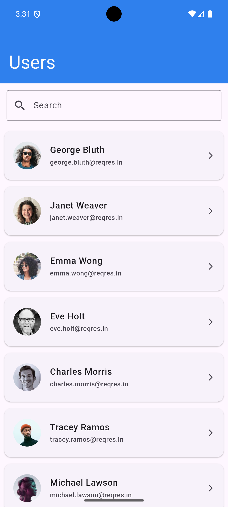
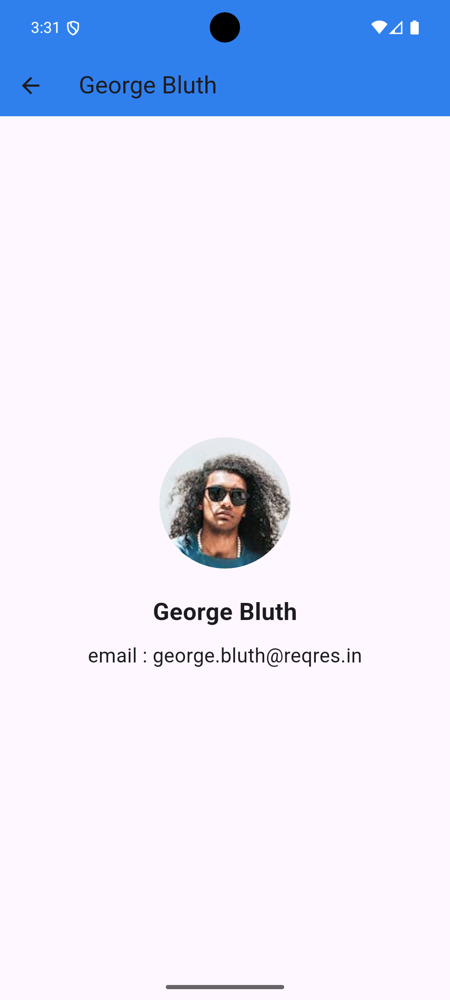

# 📱 Codebase Assignment - User Listing App

A Flutter app that fetches a paginated list of users from the ReqRes API, supports infinite scroll, search, offline cache using SharedPreferences, and follows Clean Architecture principles.

---

## 🚀 Features

- ✅ List users with name, email, and avatar
- 🔍 Search users by full name
- 🔁 Pull-to-refresh
- 📦 Pagination (infinite scroll)
- 💾 Offline caching (SharedPreferences)
- 🧱 Clean Architecture (Presentation → Domain → Data)
- 🧪 Riverpod State Management
- 🌐 API integration using Dio
- ✨ Shimmer loading effect
- ❌ Graceful error handling

---

## 📁 Project Structure

lib/
├── core/
│   ├── connectivity_notifier/    # notifier for connectivity state
│   ├── constants/                # colors,api constants
│   ├── di/                       # Dependency injection setup
│   ├── error/                    # Error handling classes
│   ├── network/                  # Network status checker
│   ├── service/                  # Common app services
│   ├── theme/                    # App themes and styles
│   ├── utils/                    # Helpers and utility functions

├── feature/user_list/
│   ├── data/
│   │   ├── api/                  # API services (Dio)
│   │   ├── mapper/               # Model ↔ Entity mappers
│   │   ├── models/               # API response models
│   │   ├── repositories/         # Repository implementations
│   │   ├── source/               # Local and remote data sources

│   ├── domain/
│   │   ├── entities/             # Domain models (UserEntity, etc.)
│   │   ├── mapper/               # Domain-specific mappers
│   │   ├── repositories/         # Repository interfaces
│   │   ├── use_cases/            # Business logic layer

│   ├── presentation/
│   │   ├── notifier/             # notifier classes
│   │   ├── pages/                # Screens/UI views
│   │   ├── widgets/              # Reusable UI components

├── main.dart                     # Application entry point
```


---

## 🧠 Clean Architecture Layers

1. **Presentation Layer**
    - `UserNotifier` (Riverpod)
    - `UserListScreen`, `UserDetailScreen`
    - Shimmer placeholders

2. **Domain Layer**
    - `UserEntity`
    - `UserRepository`, `UserUseCase`

3. **Data Layer**
    - `UserDto`, `UserResponseDto`
    - `UserRemoteDataSource`, `UserRepositoryImpl`
    - SharedPreferences cache logic

---

## 🧪 State Management

Powered by [Riverpod](https://riverpod.dev/) with `@riverpod` annotation for `UserNotifier`.

---

## 🔗 API

Data is fetched from [ReqRes API](https://reqres.in):

## 📷 Screenshots

| Users List                                        | User Detail                        
|---------------------------------------------------|--------------------------------------------------|
|       |   | 
# code_base_assignment
